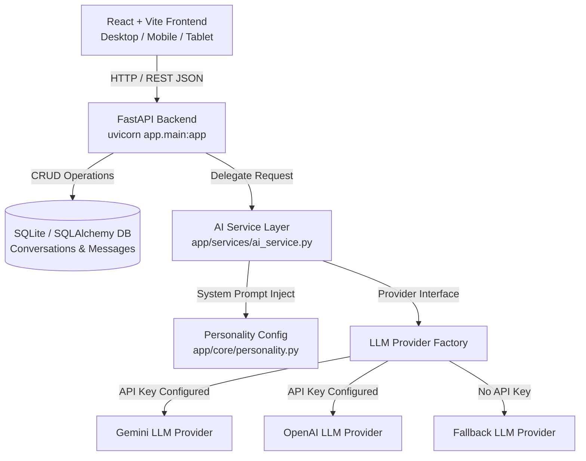

# JARVIS System Architecture (V0.1)

## Overview

JARVIS is designed as a multi-tier, modular AI assistant system. The architecture decouples the UI representation, API backend logic, persistent storage, and AI model providers.

---

## Component Breakdown

### 1. Frontend Layer (`/frontend`)
- **Framework**: React 18 with Vite, TypeScript, and Tailwind CSS v4.
- **State & Hooks**:
  - `useConversations`: Handles fetching conversation threads, creating new chats, and deleting records.
  - `useChat`: Dispatches user messages, optimist updates, handles loading states, and polls system health.
- **UI Components**:
  - `JarvisOrb`: Animated glowing core powered by Framer Motion, visually reflecting idle, thinking, and offline states.
  - `TopBar`: Real-time backend status badge, provider details, and quick preference trigger.
  - `Sidebar`: Glassmorphism history drawer with client-side conversation filtering and deletion.
  - `ChatMessage`: Markdown-rendered message bubbles with code block formatting, copy actions, and timestamps.
  - `ChatInput`: Auto-resizing textarea with keyboard shortcuts and future feature placeholders (voice, attachments).
  - `WelcomeScreen`: Hero screen displaying active JARVIS status and quick suggestion chips.
  - `SettingsModal`: Preference overlay showing live API key health, configured system prompt, and feature roadmap.

### 2. Backend Layer (`/backend`)
- **Framework**: Python FastAPI with Uvicorn server and Pydantic validation.
- **Routes (`app/api`)**:
  - `GET /api/health`: Diagnostics on server status, model provider, and API key presence.
  - `POST /api/chat`: Primary endpoint for receiving user prompt, fetching thread history, querying AI service, saving assistant output, and returning structured payload.
  - `GET /api/conversations`: Lists all historical conversations ordered by recency.
  - `POST /api/conversations`: Creates a new conversation thread.
  - `GET /api/conversations/{id}`: Retrieves thread details with ordered message history.
  - `DELETE /api/conversations/{id}`: Cascades deletion of conversation and associated messages.

### 3. AI Service & Provider Abstraction (`app/services/ai_service.py`)
- Isolates LLM interactions completely from API endpoints.
- Implements an abstract `BaseLLMProvider` interface with providers:
  - `GeminiLLMProvider`: Direct non-blocking REST API calls via `httpx` to Gemini models.
  - `OpenAILLMProvider`: OpenAI chat completion integration.
  - `FallbackLLMProvider`: Safe, conversational offline fallback when no API key is specified in `.env`.
- Integrates `JARVIS_SYSTEM_PROMPT` defined in `app/core/personality.py`.

### 4. Database Layer (`app/database`)
- **ORM**: SQLAlchemy with SQLite for local development (`jarvis.db`).
- **Data Models**:
  - `User`: Prepares schema for multi-tenant / authenticated user accounts.
  - `Conversation`: Holds conversation title, creation timestamp, and update timestamp.
  - `Message`: Stores individual messages (role: user/assistant/system, content, timestamp).
- **Migration Path**: Models use standard SQLAlchemy declarative bases, making migration to PostgreSQL / Supabase seamless by altering `DATABASE_URL`.
